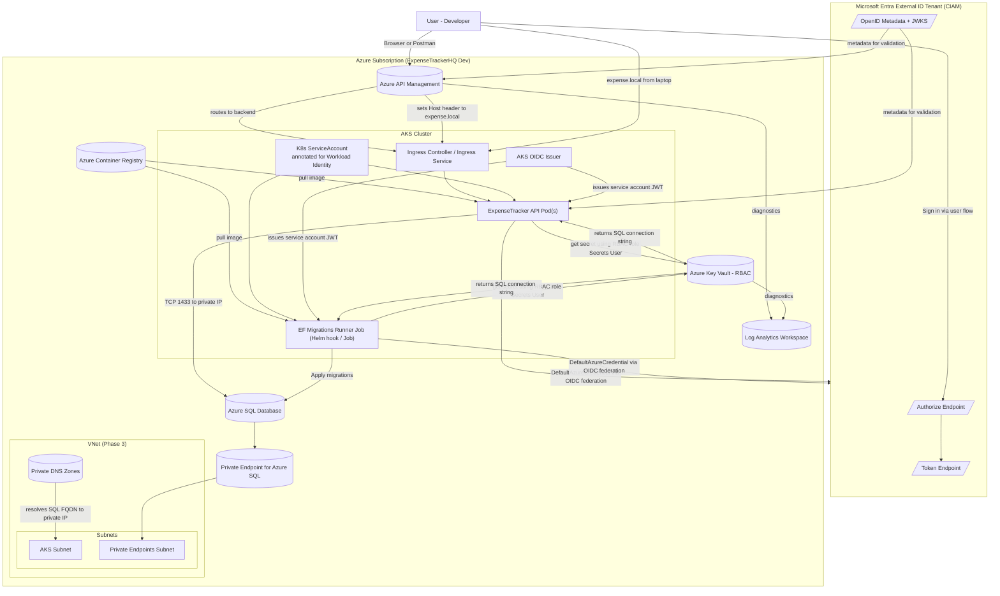

```mermaid
flowchart TB
  %% ======= USERS / CLIENTS =======
  U[User - Developer] -->|Browser or Postman| APIM

  %% ======= IDENTITY (AUTH) =======
  subgraph ENTRA["Microsoft Entra External ID Tenant (CIAM)"]
    AUTHZ[/Authorize Endpoint/]
    TOKEN[/Token Endpoint/]
    OIDC[/OpenID Metadata + JWKS/]
  end

  U -->|Sign in via user flow| AUTHZ
  AUTHZ --> TOKEN
  OIDC -->|metadata for validation| APIM
  OIDC -->|metadata for validation| API

  %% ======= AZURE SUBSCRIPTION (RESOURCES) =======
  subgraph AZ["Azure Subscription (ExpenseTrackerHQ Dev)"]
    ACR[(Azure Container Registry)]
    APIM[(Azure API Management)]
    KV[(Azure Key Vault - RBAC)]
    LA[(Log Analytics Workspace)]
    SQL[(Azure SQL Database)]

    %% Network
    subgraph VNET["VNet (Phase 3)"]
      subgraph SUBNETS["Subnets"]
        AKS_SUBNET[AKS Subnet]
        PE_SUBNET[Private Endpoints Subnet]
      end
      DNS[(Private DNS Zones)]
    end

    %% AKS
    subgraph AKS["AKS Cluster"]
      INGRESS[Ingress Controller / Ingress Service]
      API["ExpenseTracker API Pod(s)"]
      MIG["EF Migrations Runner Job (Helm hook / Job)"]
      SA["K8s ServiceAccount<br/>annotated for Workload Identity"]
      OIDC_ISSUER["AKS OIDC Issuer"]
    end

    %% SQL Private Endpoint
    SQL_PE[(Private Endpoint for Azure SQL)]
  end

  %% ======= IMAGE SUPPLY CHAIN =======
  ACR -->|pull image| API
  ACR -->|pull image| MIG

  %% ======= APIM TO AKS ROUTING =======
  APIM -->|routes to backend| INGRESS
  APIM -->|sets Host header to expense.local| INGRESS

  %% ======= LOCAL DEV DNS (YOUR MACHINE) =======
  U -->|expense.local from laptop| INGRESS
  INGRESS --> API

  %% ======= WORKLOAD IDENTITY TOKEN FLOW =======
  SA --> API
  SA --> MIG
  OIDC_ISSUER -->|issues service account JWT| API
  OIDC_ISSUER -->|issues service account JWT| MIG

  API -->|DefaultAzureCredential via OIDC federation| ENTRA
  MIG -->|DefaultAzureCredential via OIDC federation| ENTRA

  %% ======= KEY VAULT SECRET READ =======
  API -->|get secret using RBAC role Secrets User| KV
  MIG -->|get secret using RBAC role Secrets User| KV

  %% ======= SQL CONNECTIVITY (PRIVATE) =======
  KV -->|returns SQL connection string| API
  KV -->|returns SQL connection string| MIG

  API -->|TCP 1433 to private IP| SQL
  MIG -->|Apply migrations| SQL

  SQL --> SQL_PE
  SQL_PE --> PE_SUBNET
  DNS -->|resolves SQL FQDN to private IP| AKS_SUBNET

  %% ======= OBSERVABILITY (PHASE 4) =======
  APIM -->|diagnostics| LA
  KV -->|diagnostics| LA
```